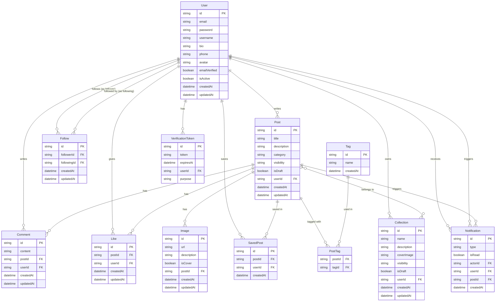
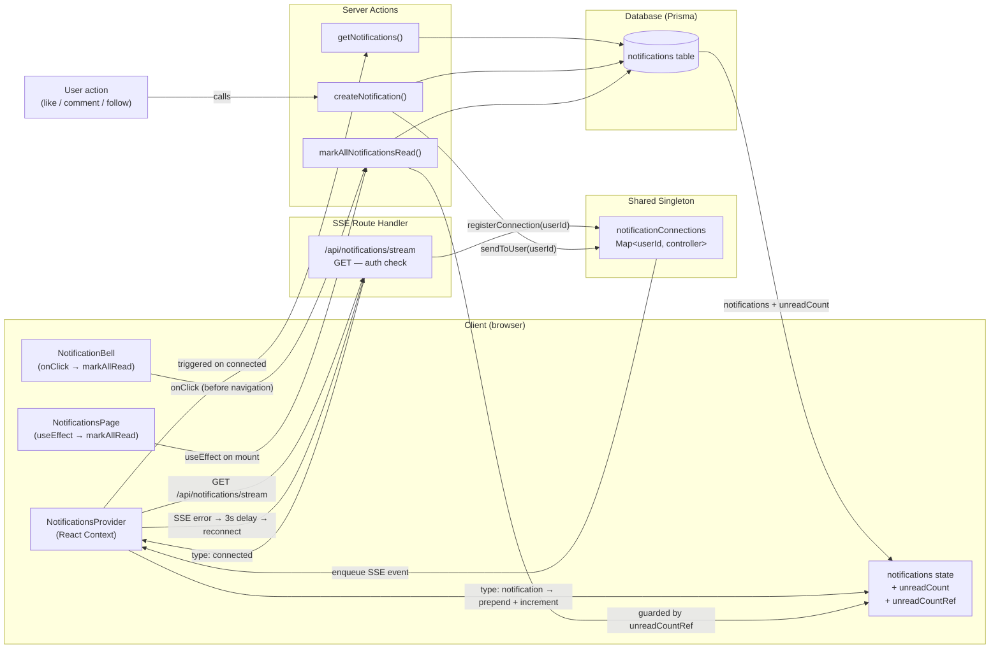
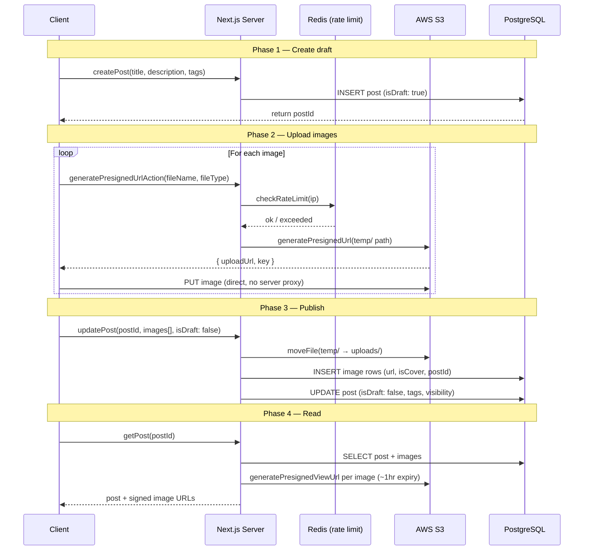

# Snippit

> A social platform for curious people. Save moments from podcasts, films, articles, and videos. Build your personal knowledge archive and discover what others are learning.

---

## Table of Contents

- [Overview](#overview)
- [Features](#features)
- [Tech Stack](#tech-stack)
- [Getting Started](#getting-started)
- [Architecture](#architecture)
- [Database Design](#database-design)
- [Key Design Decisions](#key-design-decisions)
- [License](#license)

---

## Overview

Snippit is a content curation platform where users clip and save meaningful moments from any media format. Unlike traditional bookmarking tools, Snippit is **social**, you can follow other curators, explore their collections, and build a community around shared intellectual interests.

---

## Features

### Content
- Create posts for films, podcasts, articles, YouTube videos, books, and documentaries
- Upload multiple images and videos per post with individual captions
- Save as draft or publish with `PUBLIC` / `FOLLOWERS` / `PRIVATE` visibility

### Collections
- Group posts into named, shareable collections
- Collection-level visibility controls

### Social
- Follow / unfollow users
- Like, comment, and save posts
- Real-time notifications for likes, comments, and follows (via SSE)
- Explore feed filtered by category and tag

### Profile
- Customisable avatar and bio
- Public profile with Posts and Collections tabs
- Follower / following lists with search
- Infinite scroll pagination throughout

### Media
- Drag-and-drop file uploads to S3 via presigned URLs
- Mobile camera capture (photo and video)
- Per-file upload progress tracking
- Automatic cover image selection

---

## Tech Stack

| Layer | Technology |
|---|---|
| Framework | Next.js 16 (App Router) + React 19 |
| Language | TypeScript (strict mode) |
| Database ORM | Prisma + PostgreSQL |
| Authentication | NextAuth.js |
| Styling | Tailwind CSS v4 + Framer Motion |
| Validation | Zod |
| Rate Limiting | Upstash Redis (`@upstash/ratelimit`) |
| File Storage | AWS S3 (`@aws-sdk/client-s3`) |

---

## Getting Started

### Prerequisites

- Node.js 18+
- PostgreSQL database (Neon recommended)
- AWS S3 bucket
- Google OAuth app (optional)

### 1. Clone and install

```bash
git clone https://github.com/your-username/snippit.git
cd snippit
npm install
```

### 2. Environment variables

Create a `.env.local` file in the project root, using `.env.sample` as a reference.

### 3. Database setup

```bash
# Apply migrations
npx prisma migrate deploy

# Generate Prisma client
npx prisma generate
```

### 4. Run the dev server

```bash
npm run dev
```

Open [http://localhost:3000](http://localhost:3000).

---

### Database Migrations

| Command | When to use |
|---|---|
| `npx prisma migrate dev --name <name>` | Local development — creates and applies migration files |
| `npx prisma migrate deploy` | Production / Neon — applies pending migrations safely, never resets |
| `npx prisma migrate status` | Check current migration status |

> **Warning:** Never run `prisma migrate dev` or `prisma migrate reset` against your production database.

#### Automatic migration on deploy (Vercel)

```json
{
  "scripts": {
    "build": "prisma migrate deploy && next build"
  }
}
```

---

## Architecture

### Philosophy

Earlier versions of Snippit used traditional REST API routes (`/api/...`) with client-side data fetching. This caused significant performance problems — most notably the **N+1 query problem**, where rendering a single feed triggered dozens of sequential network requests just to resolve like counts, comment counts, and author details for each post.

The app was re-architected around the **Next.js App Router** with Server Components and Server Actions to solve this at the source.

### Server-First Data Fetching

- **Aggregated queries** — Server Components perform a single Prisma query per page, using `include` and `_count` to fetch all relational data in one database trip.
- **No internal REST layer** — data is fetched inside layout and page Server Components and passed directly to Client Components as props.
- **Server Actions for mutations** — all state changes (likes, comments, follows, saves) are handled in `/actions`, keeping client JS bundles small and security logic server-side.

### Directory Structure

```
/app          Core routing. Prefer Server Components; use "use client" only when needed.
  /(routes)   Route groups for logical separation without affecting URL paths.
/actions      All Next.js Server Actions. Core business logic lives here.
/components   Reusable UI components.
/lib          Utility functions and singletons.
  prisma.ts     Prisma client initialisation.
  ratelimit.ts  Upstash Redis rate limiter setup.
/prisma       schema.prisma — all PostgreSQL model definitions.
/hooks        Custom React hooks for client-side logic.
/types        Global TypeScript interfaces.
```
---

## Database Design


---

### Server Actions Pattern

Every action returns a consistent object so Client Components can uniformly handle loading, success, and error states (e.g. with Sonner toasts):

```typescript
{
  success: boolean;
  message?: string; // On success
  error?: string;   // On failure
  code?: string;    // e.g. "UNAUTHORIZED", "RATE_LIMIT_EXCEEDED"
  data?: any;       // Returned entity or data
}
```

Each action follows a strict 5-step structure:

**1. Rate Limiting**
```typescript
const headerList = await headers();
const ip = headerList.get("x-forwarded-for") ?? "127.0.0.1";
const rateLimit = await checkRateLimit("action_name", ip, "social");

if (!rateLimit.success) {
  return { success: false, error: "Too many requests", code: "RATE_LIMIT_EXCEEDED" };
}
```

**2. Input Validation**
```typescript
if (!postId || typeof postId !== "string") {
  return { success: false, error: "Invalid post ID", code: "INVALID_INPUT" };
}
```

**3. Authentication & Authorization**
```typescript
const user = await getSession();
if (!user?.id) {
  return { success: false, error: "User not authenticated", code: "UNAUTHORIZED" };
}
```

**4. Database Operation**
```typescript
const comment = await prisma.comment.create({
  data: { postId, content, userId: user.id },
});
```

**5. Side Effects & Return** — trigger notifications, then return the standard success object. Wrap the entire function body in `try/catch`.

---

### Real-time Notification Architecture



## Flow

1. **Provider mounts** — `NotificationsProvider` is rendered once, high in the tree, wrapping `ClientShell` (which contains `Header` → `NotificationBell`). All consumers share a single state instance via React Context. There are no duplicate SSE connections or split state islands.

2. **SSE connection** — on mount, the provider opens a persistent `EventSource` to `/api/notifications/stream`. The route authenticates the user, registers a `ReadableStreamDefaultController` in the global `notificationConnections` map, and sends a `connected` handshake.

3. **Initial fetch** — on `connected`, the provider calls `getNotifications`, which returns the 20 most recent notifications with presigned S3 avatar URLs and sets both `notifications` and `unreadCount`.

4. **Real-time push** — when a user performs an action, `createNotification` writes to the DB and calls `sendToUser`, which enqueues an SSE event into the target user's open stream. The provider prepends the new notification and increments `unreadCount`.

5. **Mark as read** — triggered in two places, both reading from the same shared context:
   - `NotificationBell` calls `markAllRead()` in its `onClick` handler (before navigating), so the badge clears immediately.
   - `NotificationsPage` calls `markAllRead()` in a `useEffect` on mount, covering direct URL visits.
   
   `markAllRead` guards against no-op calls using `unreadCountRef` (a ref kept in sync with `unreadCount`) to avoid stale closure issues without adding `unreadCount` to the `useCallback` dep array. State is updated optimistically; `markAllNotificationsRead()` is then called as a plain `await` — never inside a `setState` updater — to avoid React's "setState during render" error.

6. **Reconnection** — on SSE error, the client waits 3 seconds, reopens the `EventSource`, and re-fetches on the next `connected` handshake.

## Why this structure

**Context over plain hook** — the original implementation called `useNotifications()` as a plain hook in both `NotificationBell` and `NotificationsPage`. Each call created an independent state instance with its own SSE connection. Marking all read in one had no effect on the other. Lifting into a context gives a single source of truth.

**`unreadCountRef` pattern** — to let `markAllRead` read the live unread count without including `unreadCount` in its `useCallback` dep array (which would recreate the function on every incoming notification, causing `useEffect([markAllRead])` in `NotificationsPage` to re-fire in a loop).

**No side effects inside `setState` updaters** — calling a server action (e.g. `markAllNotificationsRead()`) inside a functional updater runs during React's render phase and triggers a "setState on Router during render" error in Next.js. All server actions are called after state setters, in normal async flow.

**`globalThis` singletons** — both the Prisma client and the SSE connection store use `globalThis` singletons to survive Turbopack HMR reloads in development. Without this, the module-level `Map` resets on every file save and open connections are lost.

---

### Image Upload Architecture

All media is uploaded directly from the browser to S3 using **presigned URLs** — AWS credentials never reach the client. The bucket is **private**; image reads use short-lived presigned GET URLs generated server-side.



---

### Infinite Scroll Architecture

Infinite scroll is implemented across 6 pages — explore posts, explore collections, explore users, profile posts, profile collections, and followers/following lists — using a consistent `IntersectionObserver` pattern.

**The pattern:**
```tsx
const observer = new IntersectionObserver(
  (entries) => {
    if (entries[0].isIntersecting) loadMore();
  },
  { threshold: 0, rootMargin: "200px" }
);
observer.observe(sentinelRef.current);
```

A zero-height sentinel `<div>` sits below the last item in the list. When it enters the viewport (or comes within 200px of it via `rootMargin`), the observer fires and fetches the next page using `skip: currentItems.length` offset pagination.

---

## Key Design Decisions

**Server Actions over API Routes** — all mutations use Next.js Server Actions. Only the SSE stream uses a Route Handler, since Server Actions cannot hold open connections.

**Offset pagination over cursor pagination** — `skip / take` with `orderBy: createdAt` is used throughout. Simple to implement and sufficient for the current scale.

**Optimistic UI** — like and follow buttons update instantly and roll back on server failure, using local state paired with a Server Action.

**Visibility enforced server-side** — content visibility (`PUBLIC` / `FOLLOWERS` / `PRIVATE`) is applied at the database query level in every Server Action, never on the client.

---

## License

MIT
